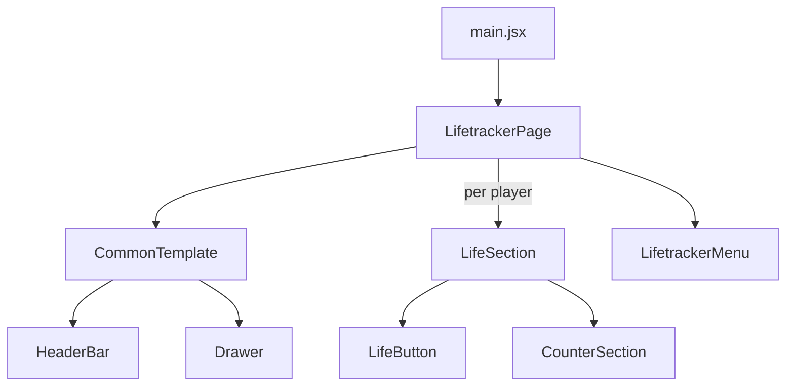

# Life Tracker App by Mike Slater

This was built to demo my CSS skills. It started as a Magic the Gathering tool. I've been able to use it to help track life totals in several games.

[View App](https://slatron.github.io/life-tracker/)

## App Features

Tracks life totals for 1 to 6 players. Each player has a main score and fourt control buttons in their life section. Each section also contains a coounter that can be used to track a value against a specific other player, such as special damage delt.

The UI can be put in "flip" mode. This rotates half of the players totals, making it easier to view if set in the middle of a play area.

## Component Tree

## Tech Used

- CSS/Sass
- React
- Vite
- github

### Style Notes

This is a great use case for using both `grid` and `flex` display together.

The life total sections are handled with `grid` display. Grid display handles multiple column layout well for more than two players.

Alignment within these sections are handled with `flex` display since these are only using a single-axis.

Root SASS is based on my long-standing settings/state/typoography patterns. Base styles are imported in main.jsx. Components each import their own local styles.

### React Notes

There are two reducers here to handle state. One is at the `LifetrackerPage` component. This tracks game state like number of players and life totals for each player.

Each `LifeSection` component has a reducer to track the special counter state for that player.

## Todo

- unit tests
- customize player names
- count up mode
